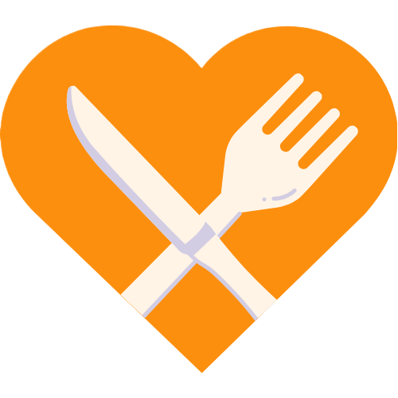

<h1 align="center">GourmetOn</h1>

<h2 align="center">Entrega do 5° Checkpoint da Disciplina de Web Development</h2>

  
  

### Engenharia de Software - FIAP - 1ESA
### Integrantes
Caio Alexandre dos Santos - RM: 558460 
Leandro do Nascimento Souza - RM: 558893 
Italo Caliari Silva - RM:554758 
Rafael de Mônaco Maniezo - RM: 556079 
Vinicius Rozas Pannuci de Paula Cont - RM:555338

### Tecnologias

## Descrição do Projeto
Esse projeto consiste em uma landing page dedicada ao aplicativo de delivery fictício <b>GourmetOn</b>. O objetivo desse Checkpoint foi implementar conhecimentos de React, assim como a utilização de Styled Components para a estilização em componentes. Além disso, há a utilização de <code>fetch</code> para fazer o consumo de uma API de alimentos, a TheMealDB.
### GourmetOn
O GourmetOn é um aplicativo de delivery inovador! Possuímos um menu extremamente diversificado, com diversas culinárias diferentes, para todos os gostos. Explore os mais diversos tipos de prato, faça seu pedido e receba em sua casa em instantes!
